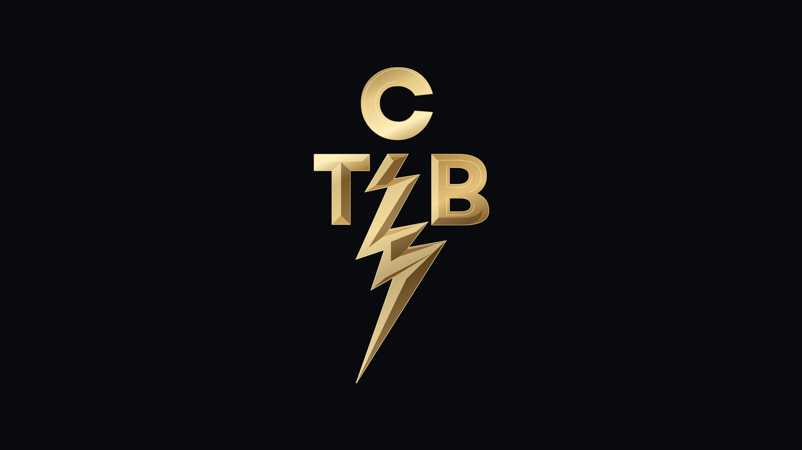

# Omarchy Elvis Boot + TCB

**Taking care of business, one session at a time.**

A personal Elvis intro for Omarchy. A gold TCB lightning bolt opens each desktop
session, and three vector portraits of Elvis draw themselves after later unlocks.
An optional photo screensaver brings the original pictures to your idle desktop.



[Watch the TCB intro in 4K at 60 fps](preview/tcb-boot-4k.mp4) ·
[Watch the Elvis unlock sequence](preview/elvis-sequence.mp4)

## What happens

| Event | Animation |
| --- | --- |
| Start a new desktop session | TCB draws in, settles into faceted gold, and fades after 2.35 seconds |
| Start while the screen is locked | TCB waits until the first unlock |
| Unlock later in the same session | Three Elvis portraits play in order **3 → 2 → 1**, about one second each |
| Wake from sleep or restart the shell | TCB stays quiet |
| Lock again during an animation | The overlay closes immediately |

The portrait order moves from the full-body stage pose to the microphone portrait
and then the profile. The last portrait fades out after another 350 ms.

The overlays appear on every monitor, pass clicks through, and never take keyboard
focus. There is no audio. Rendering windows exist only while an animation plays.

## Requirements

- Omarchy with the Quickshell shell and its `omarchy.lock` service
- Quickshell and Qt 6.10 or newer
- Bash and `jq` for installation

This targets the newer Omarchy shell. The older Hyprlock and Waybar setup is not
supported by this plugin. On current Omarchy releases, the TCB startup intro and
manual preview work without access to the privileged lock service. The portrait
sequence requires a shell version that exposes lock-state changes to the plugin.
The vector artwork is bundled, so installation does not require the original
photographs or any image processing tools.

## Install

Run these commands from your Omarchy desktop session:

```bash
git clone https://github.com/miikaTheCoder/omarchy-elvis-boot-tcb.git
cd omarchy-elvis-boot-tcb
bash scripts/install.sh
```

The installer backs up your shell configuration, any previous copy of this plugin,
and an existing TCB startup hook. It then installs:

- The plugin in `~/.config/omarchy/plugins/nextg.elvis-unlock/`
- A startup hook in `~/.config/omarchy/hooks/post-boot.d/elvis-tcb-boot`

Backups live in `~/.config/omarchy/backups/elvis-unlock/`.
Packaged Omarchy files and authentication settings are untouched.

The installer restarts the shell only when an older in-memory copy of the
service is still loaded.

If an Elvis command reports `Target not found.`, the service is installed but
not loaded. Rescan and enable it, then retry the preview:

```bash
omarchy shell shell rescanPlugins
sleep 1
omarchy plugin enable nextg.elvis-unlock
omarchy restart shell
omarchy shell elvis tcbPreview
```

Installing, updating, or restarting the shell does not consume the next startup
intro. TCB runs automatically when the next desktop session starts.

## Try it without rebooting

```bash
# Preview the Elvis portraits.
omarchy shell elvis preview

# Preview TCB without consuming the next startup intro.
omarchy shell elvis tcbPreview

# Stop an animation or inspect its state.
omarchy shell elvis stop
omarchy shell elvis status
```

You can also open `preview/index.html` to replay the portraits, inspect each still,
and experiment with timing and line color. Its controls affect that preview only.

## Customize

Edit the files in `plugin/nextg.elvis-unlock/`, then rerun the installer.

| File | Controls |
| --- | --- |
| `Service.qml` | Unlock behavior and `portraitMs`, which defaults to `1000` |
| `Sequence.qml` | Portrait line color, sizing, fades, and desktop dimming |
| `BootSequence.qml` | TCB timing, size, and its brief highlight |
| `TcbArt.js` | Editable TCB contours and gold facets |
| `TcbMark.qml` | TCB drawing animation and material colors |
| `Portraits.js` | Grouped vector paths used by the native portrait renderer |

Standalone SVGs live in `assets/`. The TCB emblem is rendered directly from curves,
with a separate halo during its brief highlight. It has no permanent blur layer.

## Elvis photo screensaver

The optional screensaver cycles through your original photographs in order
**3 → 2 → 1**, changing every eight seconds with a 900 ms dissolve. Each monitor
shows the same picture, fitted against black without cropping or added blur.
Move the mouse, click, scroll, or press a key to close it. There is no audio.

Install it using the directory containing the three original photo filenames:

```bash
python scripts/install_screensaver.py --photos-dir /path/to/your/elvis/photos
omarchy restart shell
```

You can also supply any photos in your preferred playback order:

```bash
python scripts/install_screensaver.py /path/to/1970.jpg /path/to/1972.jpg /path/to/1973.jpg
```

The installer copies the photos into your personal Omarchy configuration. They
are not included in this repository. It adds **Omarchy menu > Elvis Screensaver**:

- **Preview** plays the photos immediately, even when Stay Awake is on.
- **Enabled** toggles automatic photo playback. A check mark means on.

**System > Elvis Screensaver** also previews it, and **Trigger > Toggle > Elvis
Screensaver** uses the same switch. Turning off the screensaver does not disable
automatic locking. **Stay Awake** is a separate Omarchy control that pauses both
automatic screensaver and locking; the installer preserves its current setting.

From a terminal:

```bash
~/.local/bin/elvis-screensaver --force
~/.local/bin/elvis-screensaver --toggle
~/.local/bin/elvis-screensaver --stop
```

The installer uses `omarchy plugin clone omarchy.idle`, then changes only the
screensaver launch command in your clone. Omarchy still handles idle inhibition,
window dismissal, the lock deadline, and waking. Existing timing settings remain
unchanged, normally 150 seconds for the screensaver and 300 seconds for locking.
The screensaver retains Omarchy's app ID so its normal lock command closes it.
It is a screensaver, not a replacement for the lock screen.

The photo renderer uses Quickshell's [application ID configuration](https://quickshell.org/docs/v0.3.0/guide/advanced/)
and the fullscreen rules provided by the current Omarchy Hyprland setup.
Installation requires Python 3 in addition to the normal plugin requirements.
The originals retain their source resolution; they are not AI upscaled.

Configuration lives in `~/.config/omarchy/elvis-screensaver/photos.json`.
Change `intervalMs` to adjust pacing. Changes apply on the next launch.
To update the screensaver code while keeping your photos and pacing, rerun
`python scripts/install_screensaver.py` without photo arguments, then restart the
shell. The installer backs up existing settings, photos, menu extensions, and
the idle clone under `~/.config/omarchy/backups/elvis-screensaver/`.

The idle clone is based on the Omarchy version installed when you first run the
installer. Later Omarchy updates do not automatically update cloned service code.

## Disable

Disable the whole plugin:

```bash
omarchy plugin disable nextg.elvis-unlock
```

To keep Elvis on unlock but disable TCB on future startups, remove only its hook:

```bash
rm ~/.config/omarchy/hooks/post-boot.d/elvis-tcb-boot
```

## How startup stays exclusive

The post-boot hook creates a request under `$XDG_RUNTIME_DIR/elvis-tcb-boot/`, keyed
by the Hyprland session identity. A pending request survives shell restarts and
waits while the screen is locked. Before showing TCB, the service records that the
request has been consumed. Later unlocks and repeated hook calls cannot replay it.

Ordinary unlocks only trigger the portrait sequence. The service does not poll
for lock state or run hidden animations while idle.

## Render a sharp preview

Start the native preview in one terminal:

```bash
quickshell -p "$PWD/preview.qml"
```

Then export from another terminal:

```bash
python scripts/render_clip.py --tcb --width 3840 --height 2160 --fps 60 \
  --output preview/tcb-boot-4k.mp4

python scripts/render_clip.py --width 1920 --height 1080 --fps 60
```

The exporter lays out the actual QML scene at the requested resolution. Resizing
or tiling the preview window cannot reduce the output resolution. Each frame's
dimensions are checked before encoding, and a lossless PNG is saved beside the
video. Temporary frames are removed afterward. Python 3 and FFmpeg are required.

Use the lossless PNG at 100% zoom to inspect the vector edges without video
compression or player scaling.

## Rebuild the artwork

The photographs are not included. To retrace them, provide a directory containing
the source filenames listed in `scripts/trace_portraits.py`:

```bash
python scripts/trace_portraits.py --photos-dir /path/to/your/elvis/photos
python scripts/build_preview.py
node scripts/build_tcb_svg.mjs
```

Tracing uses Python 3 and ImageMagick. The head and facial features in the first
portrait are manually traced. Other contours combine cleaned photographic edges
with manually drawn paths. The TCB SVG builder uses Node.js with no dependencies.

## Checks

```bash
omarchy plugin validate plugin/nextg.elvis-unlock
python scripts/check_boot_hook.py
python scripts/check_screensaver.py
quickshell -p "$PWD/check-unlock.qml"

test_directory="$(mktemp -d /tmp/elvis-boot-test.XXXXXXXX)"
ELVIS_TEST_BOOT_STATE="$test_directory/state" \
  quickshell -p "$PWD/check-boot.qml"
```

The QML checks use a mock lock service and never lock the real desktop. They cover
ordinary unlocks, relocking during playback, startup while locked, repeated startup
requests, and pending or consumed requests surviving a service restart.

## License

See [LICENSE](LICENSE).
